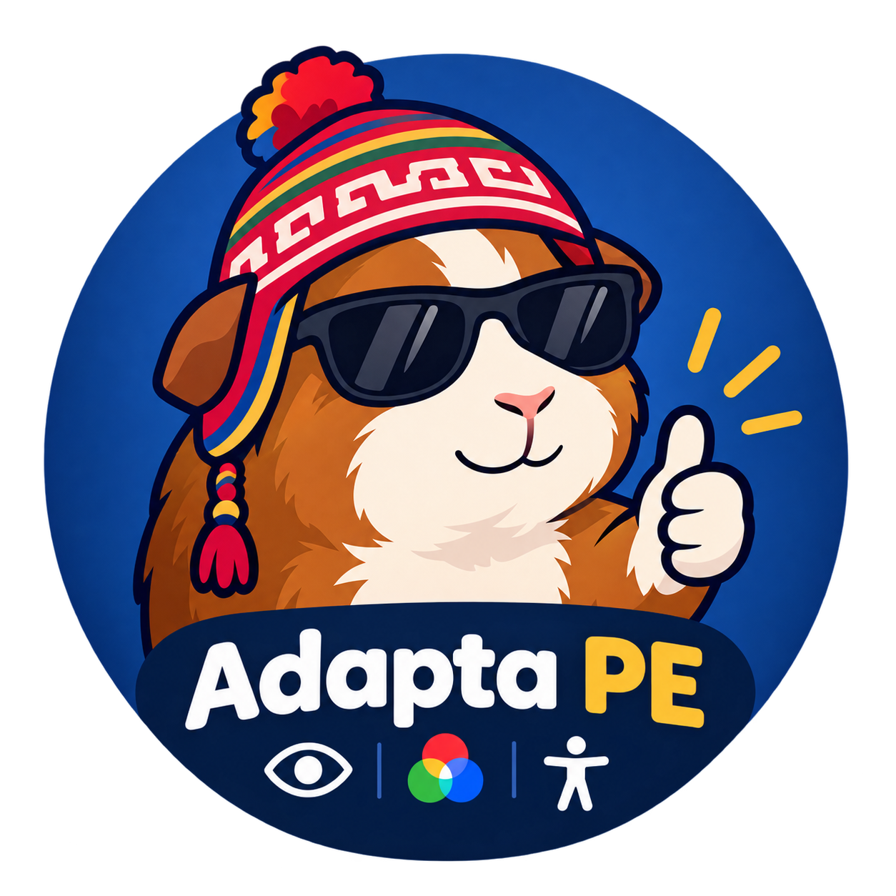

  

# Adapta-PE OS ♿️💻

Adapta-PE OS es una aplicación de accesibilidad avanzada para macOS construida con Swift y SwiftUI. Está diseñada para facilitar la interacción con la computadora a personas con discapacidades motoras o movilidad reducida, ofreciendo un control total del sistema a través de movimientos corporales (Mouse Cinético) y comandos de voz (Asistente Local impulsado por Inteligencia Artificial).

## ✨ Características Principales

### 🎯 Mouse Cinético (Seguimiento Óptico)
- **Control sin manos:** Utiliza la cámara (integrada o externa) para rastrear el movimiento y mover el cursor del mouse.
- **Detección inteligente:** Capaz de rastrear la mano ✋, el brazo 💪 (izquierdo o derecho) o la cabeza 🧠 de forma automática utilizando el framework `Vision` de Apple.
- **Zonas de Interacción:** 
  - Zona Muerta (para mantener el cursor quieto).
  - Zona de Atracción (para movimientos finos).
  - Clic Automático al mantener la posición (*dwell click*).
- **🛡️ Modo Parkinson:** Un filtro anti-temblor especializado que reduce la sensibilidad, amplía las zonas muertas y estabiliza el cursor, ideal para personas con temblores involuntarios.
- **Pausa Automática:** El seguimiento se desactiva temporalmente si el usuario mueve el mouse físico.

### 🎙️ Asistente de Voz Inteligente
- **Reconocimiento continuo:** Escucha siempre activa mediante `SFSpeechRecognizer` de Apple (español `es-PE`).
- **Palabra de Activación (Wake Word):** Personalizable (por defecto: *"computadora"*).
- **Ejecución de Comandos Locales:**
  - Apertura rápida de páginas como Mercado Libre, YouTube, Google y Canvas.
  - Abrir y cerrar aplicaciones del sistema.
  - Soporte multimonitor (ej. "Abre Safari en el segundo monitor").
  - Simulador de teclado y ratón (copiar, pegar, enter, scroll, clic derecho/izquierdo).
  - Búsqueda web inteligente filtrada.

### 🧠 Integración con IA y Ojo Biónico (NVIDIA NIM)
- **Chat Inteligente:** Cuando el asistente no reconoce un comando del sistema, la consulta se delega automáticamente a un modelo de IA avanzado (`meta/llama-3.2-11b-vision-instruct`).
- **👁️ Ojo Biónico:** Al decir comandos como *"lee la pantalla"* u *"ojo biónico"*, la aplicación toma una captura de pantalla de forma silenciosa, la envía a la IA de visión y le lee en voz alta al usuario qué elementos interactivos hay en la pantalla, permitiendo tomar decisiones sin ver claramente la interfaz.

### 🖼️ Interfaz Picture-in-Picture (PiP)
- La aplicación puede ejecutarse en **Modo Escritorio Completo** para configuraciones o en **Modo Flotante (PiP)**.
- El Modo PiP se ancla a la barra de estado superior, siendo siempre visible sobre cualquier otra aplicación (incluso navegadores en pantalla completa).

## 🛠️ Tecnologías y Arquitectura

El proyecto está desarrollado nativamente para macOS usando las siguientes tecnologías:
- **SwiftUI & AppKit:** Para la interfaz gráfica, ventanas y manipulación de monitores/resoluciones.
- **AVFoundation:** Para la captura de audio y video en tiempo real.
- **Vision:** Para la detección mediante Machine Learning local de rostros, manos y poses corporales.
- **Speech & AVSpeechSynthesizer:** Para el reconocimiento de voz (Voice-to-Text) y síntesis de voz (Text-to-Speech).
- **CoreGraphics:** Para la manipulación y simulación a bajo nivel de los eventos del mouse y teclado físicos del Mac.
- **AppleScript:** Para interactuar y automatizar otras aplicaciones del sistema (como navegadores y administración de ventanas).
- **NVIDIA NIM API:** Integración REST para el modelo LLaMa 3.2 Vision.

## 📂 Estructura del Código

- `Adapta_PEApp.swift`: Punto de entrada de la aplicación. Configura el ciclo de vida y los estilos de ventana (sin bordes, transparentes, etc.).
- `ContentView.swift`: La interfaz principal. Contiene el diseño, la vista de la cámara, los toggles de configuración y el sistema PiP inteligente.
- `TrackingManager.swift`: El corazón del *Mouse Cinético*. Captura el feed de video, utiliza `VNImageRequestHandler` para buscar partes del cuerpo, aplica cálculos matemáticos para el suavizado de movimiento (cinemática) y dispara los eventos `CGEvent` para mover el cursor y hacer clics.
- `VoiceManager.swift`: Gestor del micrófono. Configura `SFSpeechRecognizer`, procesa de manera continua el audio (con lógica anti-crash y debounce), extrae la palabra de activación y pasa la orden limpia al `ActionManager`.
- `ActionManager.swift`: El cerebro de ejecución. Realiza el enrutamiento de comandos (if/else), dispara AppleScripts para el manejo de ventanas, interactúa con la API de NVIDIA para el *Ojo Biónico* y el chat general, y sintetiza las respuestas por voz.

## ⚙️ Configuración y Uso

1. Al abrir la app, deberás conceder **Permisos de Cámara y Micrófono**, además de permisos de **Accesibilidad** (para que CoreGraphics pueda mover el mouse) y **Automatización** (para AppleScript).
2. Ingresa tu **API Key de NVIDIA** en la ventana principal para activar las funciones de Inteligencia Artificial Avanzada.
3. Puedes cambiar el nombre del asistente en la interfaz.
4. Activa el **Modo Flotante** para mantener el widget discreto en una esquina de la pantalla.
5. ¡Habla o muévete! (Ej: *"Computadora, ojo biónico"*, *"Computadora, abre Youtube en el segundo monitor"*).
